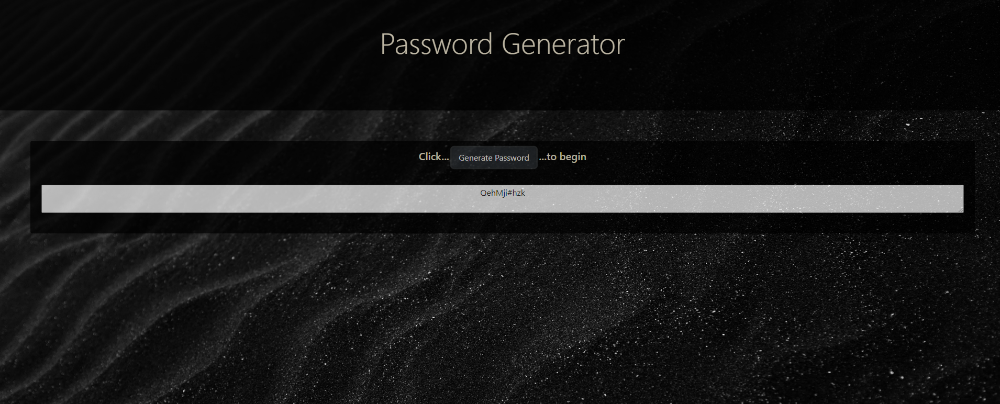

<!-- # 03 JavaScript: Password Generator

Create an application that generates a random password based on user-selected criteria. This app will run in the browser and feature dynamically updated HTML and CSS powered by your JavaScript code. It will also feature a clean and polished user interface and be responsive, ensuring that it adapts to multiple screen sizes.

If you are unfamiliar with special characters, take a look at [some examples](https://www.owasp.org/index.php/Password_special_characters).

## User Story

```
AS AN employee with access to sensitive data
I WANT to randomly generate a password that meets certain criteria
SO THAT I can create a strong password that provides greater security
```

## Acceptance Criteria

```
GIVEN I need a new, secure password
WHEN I click the button to generate a password
THEN I am presented with a series of prompts for password criteria
WHEN prompted for password criteria
THEN I select which criteria to include in the password
WHEN prompted for the length of the password
THEN I choose a length of at least 8 characters and no more than 128 characters
WHEN prompted for character types to include in the password
THEN I choose lowercase, uppercase, numeric, and/or special characters
WHEN I answer each prompt
THEN my input should be validated and at least one character type should be selected
WHEN all prompts are answered
THEN a password is generated that matches the selected criteria
WHEN the password is generated
THEN the password is either displayed in an alert or written to the page -->
```

# JavaScript: Password Generator
 


### The goal of this project is to make a randomly generated password that a range of selected user criteria and allows them to smoothly and easily get a fresh and secure password. 




## Table of Contents
* [Technologies Used](Technologies_Used)
* [Deployed Site](Deployed)
* [Features](Features)
* [Usage](Usage)
* [Author](Author)
* [Credits](Credits)
* [License](License)

## Technologies_Used
* HTML (27.3%)
* CSS (16.4%)
* Javascript (56.3%)

## Deployed Site
[Responsive Portfolio](https://rksouth.github.io/responsive_portfolio/)

## Features 


__1. A series of prompts for password criteria__
 
_Why?_

To allow users to determine how secure they want their passwords. For instance, some security prompts require special charcters and some don't allow them. We wanted to create a password generator that any employee could use to secure infomration regardless of the specific requirements of their application. One generator to rule them all. 

_What?/How?_

   


__2. Validation for correct Input__

_Why?_

    This feature does feed into the others but I felt it important to address this issue seperately. Before completely this projects, I saw a lot of code examples and projects similar to mine that did not validate and accepted incorrect input. I chose to build my validation in but I do know there are people that consider checking for a correct answer very different than checking for an answer. 


_What?/How?_
	
        In order to have a customizable password, selections need to be made before the password is generated. Therefore, when the button "Generate Password" is clicked a prompt comes up allows the user to input their specific criteria. If they don't enter any valid criteria then they alerted and sent back to the previous prompt to enter in valid criteria. If they do not select some combination of upper case, lower case, numbers and special characters they will be prompted again. 

	

    I created a series of while loops and if/else (conditional) statements that look for a boolean (true or false) of happyYet if we aren't happy Yet then we create more prompts/alerts. Each time a new loop on a new condition runs, happy Yet is reset and we have to use the conditional statement to turn it back to true. This is nested in yet another loop that checks if there are any yes statements. In this way we never leave anyone behind. Wrapping the major criteria (all except the password length) in another loop ensures that the user has to have some criteria. If they were to select no for everything then there woud be no way to generate a password. 

    Although it is not pictures, if you were to check the console log as you were making selections through the prompt you would see it logging the various selections made by the user. If for some reason the program broke or wasn't generating the kind of password intended this would show you where it may have gone and if the user misselected something. In future version I would like to display the selections on the page to allow the user to confirm these things without having to use the console log. 

__3. A Generated password that meets all criteria__

_Why?_

If the page resizes and components of the page resize and the image doesn't, we end up with a page that is only image and nothing else. If you are working on a smaller screen this is just no beuno. It make the screen and by extension the site completely unusable and when it comes to webpage design usability needs to be the number one concern.


_What?/How?_


Above is an image of the portfolio section with a very interesting bird on it. This is the collaposed version of the website. Note how the navbar is a small drop down square instead of 3 different items and how the "bird" takes up the whole screen. The card does show some uneven margins but it does resize. Also note, how the image that was once left to to it (you can see the original below and there is nice spacing there. 


   I found the answer to be simpler than I would have originally thought. Creating first 3 rows, then 2 collumns per row, adding a padding of 3, making sure the image was fluid and that collapsed at just the right time. 
	
   
    
__3. Other/Potentional Complaints__

* All the colors in the CSS are green

_Why?_

   I originally meant to resize it using CSS to make it more navigatible. However, I decided I like the simplicty of a little bit of mountain and a lot of sky. I also anticipate that my portfolio will grow and change and as it does my background image will become more visible-as the page gets longer. I love adding those little bits of surprise to my code and designs, it's like a fruity after taste that lingers in your mouth after a really good desert. 

* I used prompts instead of confirm statements

_Why?_

   I have a lot reasons I can give for this but mainly it's because I am too stubborn for my own good. Though, the challange was fun to try to get a card to work instead of using sanity, I would probably not do it again. I had a vision, and I was sure I could make it work. I hope, reader, that you think it worked as well as I did. 
   
   If I were going to do this again, I would use CSS or a style tag to make a background inside of a container instead of using a card. 

* There are not that many commits

_Why?_

   I did most of the preliminary figuring out of my random generator and my button on paper and with my study group. There was an extensive amount of pseudocode/whiteboarding before I began typeing things in. I used my notes from the previous week to piece things together and think about how they would work or wouldn't work. I suppose I could add pictures of my notes but I am horribly ashamed of how messy they might look, and seeing as they were just for me -there is a huge chance that if you could them, you wouldn't be able to make sense of them. 

   * Your Portfolio is just pictures of projects with no github links

_Why?_

   I have the preliminary git hub repos made for those projects and I would like to add them in. But I wasn't sure exactly what my readme should look and that is a project for my "extra projects" time. I also want to just get a better idea of what it would like when I do have projects in there. 
  

## Usage
### How do you use this project? You may use it nearly anyway you see fit however, if you feel lost, scared and alone; I have some suggestions for you. 
 1. You may admire it, sit back and take in the beauty. Peruse through the code. Enjoy it as if it were an old coletrain record, Bach or Monet. So, I might not be quite there yet but not every note written by Bach was divined, Coletain didn't start out great and in the beginning Monet's art looked like everyone elses at the time.
 2. You can judge it. You can critisize and even give useful feedback. How can I improve? Do you know how to write code as beautiful as Monet paints- I want to know your secrets.
 3. You can x out. You came here by accident and only realized right now you weren't suppose to be here. So, it's cool. Have a good night. 
## Author 
Rachael Kelm-Southworth

* [linkedin] (https://www.linkedin.com/in/rachael-kelm-southworth-87a3831b3) 

* [github] (https://github.com/RKSouth/)

 ## Credits

I would like to thank Kerwin, Manuel, Roger, Jerome and all my classmates for helping me understand this subject matter and anyone that contributed to make the base code.

## License
[MIT](https://choosealicense.com/licenses/mit/)


